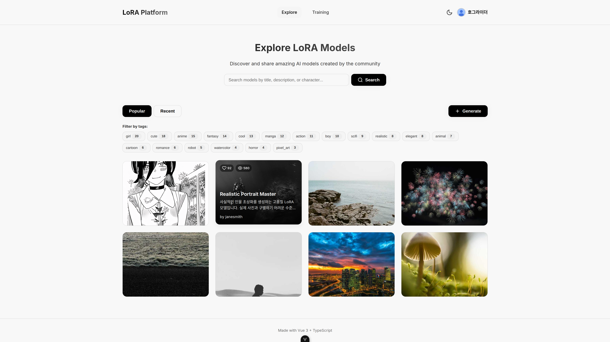
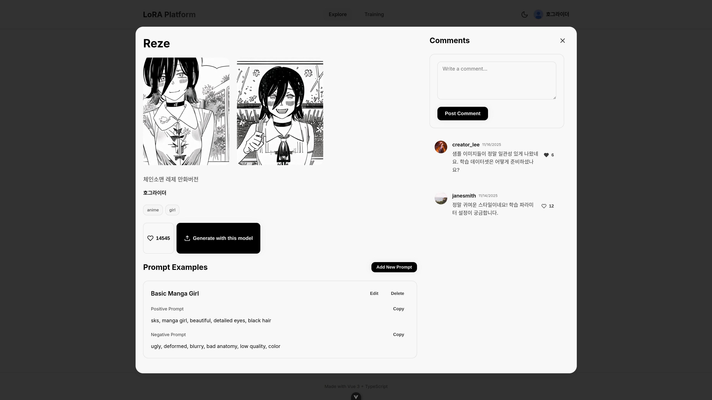

# LoRA Platform UI

> 만화/웹툰 캐릭터 LoRA 모델 학습, 생성, 공유를 위한 커뮤니티 플랫폼의 프론트엔드입니다.

**배포 주소:** [http://blueming-front.s3-website.ap-northeast-2.amazonaws.com/](http://blueming-front.s3-website.ap-northeast-2.amazonaws.com/)




---

## 기술 스택


---

## 주요 기능

- **다크/라이트 모드**: `useTheme` 컴포저블을 통해 사용자가 선호하는 테마(다크/라이트)를 선택하고 LocalStorage에 저장하여 유지합니다.
- **반응형 디자인**: 모바일, 태블릿, 데스크톱 모든 기기에서 최적화된 UI를 제공합니다.
- **간편 로그인**: Google OAuth2를 통한 소셜 로그인을 지원하며, JWT를 사용해 인증 상태를 관리합니다.
- **모델 탐색**: 키워드 검색, 최신순/인기순 정렬, 태그 필터링 등 강력한 탐색 기능을 제공합니다.
- **이미지 생성**: Stable Diffusion 모델과 LoRA를 조합하여 이미지를 생성하며, SSE를 통해 실시간 진행 상황을 표시합니다.
- **LoRA 학습**: 사용자가 업로드한 이미지로 LoRA 모델을 학습시키며, 실시간으로 학습 진행률을 확인할 수 있습니다.
- **커뮤니티 기능**: 모델에 대한 좋아요, 즐겨찾기, 댓글 기능을 통해 사용자 간의 소통을 지원합니다.

---

## 시스템 아키텍처 및 프로젝트 구조

### 시스템 아키텍처
```
┌─────────────┐      ┌──────────────────┐      ┌─────────────────┐
│   Vue.js    │ ←──→ │  Spring Boot 3   │ ←──→ │    FastAPI      │
│  (Frontend) │      │    (Backend)     │      │  (AI Service)   │
└─────────────┘      └────────┬─────────┘      └─────────────────┘
                              │
                              ↓
                     ┌─────────────────┐
                     │  AWS RDS (DB)   │
                     └─────────────────┘
```

### 프로젝트 구조
```
src/
├── assets/
│   └── main.css              # 전역 스타일 및 CSS 유틸리티 클래스
├── components/
│   ├── Navigation.vue        # 네비게이션 바
│   ├── ModelCard.vue         # 모델 정보 카드
│   ├── GenerateModal.vue     # 이미지 생성 모달
│   └── ThemeToggle.vue       # 다크/라이트 모드 토글
├── composables/
│   └── useTheme.ts           # 테마 관리 로직
├── views/
│   ├── ModelList.vue         # 모델 목록 페이지
│   ├── GenerateDebug.vue     # 이미지 생성 테스트 페이지
│   └── ...                   # 기타 라우팅 페이지
├── services/
│   └── api.ts                # API 클라이언트
├── router/
│   └── index.ts              # Vue Router 설정
├── App.vue                   # 루트 컴포넌트
└── main.ts                   # 애플리케이션 엔트리 포인트
```
---
##  CI/CD

- **GitHub Actions**를 사용하여 CI/CD 파이프라인을 구축했습니다.
- `main` 브랜치에 코드가 푸시되면 다음 프로세스가 자동으로 실행됩니다:
  1.  Node.js 환경을 설정합니다.
  2.  프로젝트 의존성을 설치합니다 (`npm install`).
  3.  프로젝트를 빌드합니다 (`npm run build`).
  4.  AWS S3 버킷에 빌드된 정적 파일을 배포하여 사용자가 항상 최신 버전을 이용할 수 있도록 합니다.

---

## 시작하기 (Getting Started)

### 1. 환경 변수 설정

프로젝트가 백엔드 API와 통신하려면 `.env` 파일에 API 서버 주소를 명시해야 합니다.

```env
# .env
VITE_API_URL=http://localhost:8080       # 메인 백엔드 API 서버
VITE_FASTAPI_URL=http://localhost:8000   # AI/ML 모델 서버
```

### 2. 의존성 설치 및 실행

```bash
# 의존성 설치
npm install

# 개발 서버 실행
npm run dev
```

개발 서버는 기본적으로 `http://localhost:5173`에서 실행됩니다.

---

## CSS 유틸리티 클래스

재사용 가능한 유틸리티 클래스를 `src/assets/main.css`에 정의:

### Layout
- `.container`, `.container-sm`
- `.flex`, `.flex-col`, `.grid`
- `.items-center`, `.justify-between`
- `.gap-{xs,sm,md,lg,xl}`

### Spacing
- `.p-{xs,sm,md,lg,xl}` - padding
- `.m-{xs,sm,md,lg,xl}` - margin
- `.px-*`, `.py-*`, `.mx-*`, `.my-*`

### Typography
- `.text-{xs,sm,base,lg,xl,2xl,3xl,4xl}`
- `.font-{normal,medium,semibold,bold}`
- `.text-{primary,secondary,muted,success,error}`

### Components
- `.btn`, `.btn-primary`, `.btn-secondary`, `.btn-ghost`
- `.card`, `.card-sm`, `.card-clickable`
- `.input`, `.textarea`, `.label`
- `.badge`, `.tag`
- `.avatar`, `.avatar-sm`, `.avatar-lg`

### Utilities
- `.w-full`, `.h-full`
- `.rounded`, `.rounded-lg`, `.rounded-full`
- `.shadow`, `.shadow-md`, `.shadow-lg`
- `.loading`, `.skeleton`