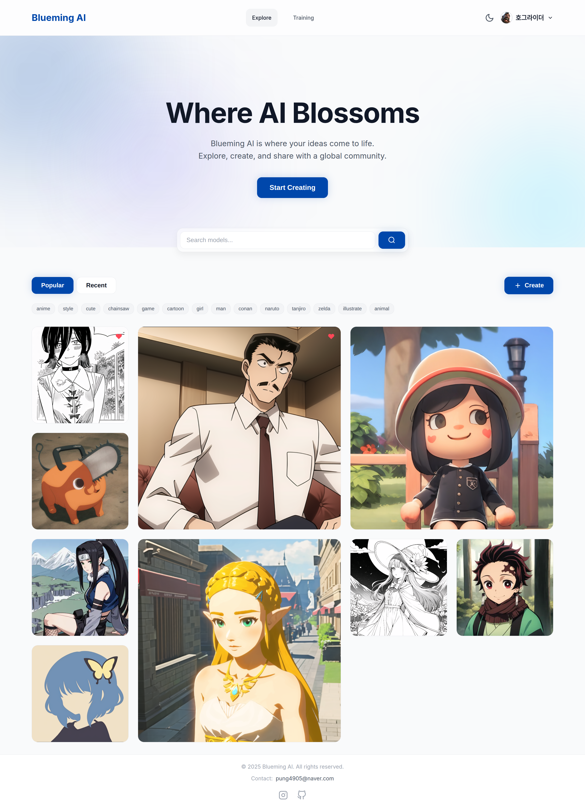

# LoRA Platform UI

> 만화/웹툰 캐릭터 LoRA 모델 학습, 생성, 공유를 위한 커뮤니티 플랫폼의 프론트엔드입니다.




---

## 기술 스택


---

## 주요 기능

- **다크/라이트 모드**: `useTheme` 컴포저블을 통해 사용자가 선호하는 테마(다크/라이트)를 선택하고 LocalStorage에 저장하여 유지합니다.
- **반응형 디자인**: 모바일, 태블릿, 데스크톱 모든 기기에서 최적화된 UI를 제공합니다.
- **다양한 로그인 방식**:
  - **Firebase 이메일 로그인**: Firebase Authentication을 사용한 이메일/패스워드 인증 방식입니다. 프론트엔드에서 Firebase SDK로 직접 인증하고, 발급받은 ID Token을 백엔드로 전송하여 JWT로 교환합니다.
  - **Google OAuth2 로그인**: Spring Security OAuth2를 통한 백엔드 경유 인증 방식입니다. 사용자가 Google 로그인 버튼을 클릭하면 백엔드의 `/oauth2/authorization/google` 엔드포인트로 리다이렉트되어 인증 후 JWT를 발급받습니다.
- **모델 탐색**: 키워드 검색, 최신순/인기순 정렬, 태그 필터링 등 강력한 탐색 기능을 제공합니다.
- **이미지 생성**: Stable Diffusion 모델과 LoRA를 조합하여 이미지를 생성하며, SSE를 통해 실시간 진행 상황을 표시합니다.
- **LoRA 학습**: 사용자가 업로드한 이미지로 LoRA 모델을 학습시키며, 실시간으로 학습 진행률을 확인할 수 있습니다.
- **커뮤니티 기능**: 모델에 대한 좋아요, 즐겨찾기, 댓글 기능을 통해 사용자 간의 소통을 지원합니다.

---

## 주요 링크

### Production (현재 - Self-hosted 미니 PC)
- **Frontend**: https://blueming.rheon.kr
- **Backend API**: https://api-blueming.rheon.kr
- **Swagger UI**: https://api-blueming.rheon.kr/swagger-ui.html
- **Health Check**: https://api-blueming.rheon.kr/actuator/health
- **MinIO Storage**: https://storage.rheon.kr
- **MinIO Console**: https://minio.rheon.kr

### 과거 배포 주소 (AWS + JCloud)
- **Frontend (AWS CloudFront)**: https://d2f4r8lrfwl0ez.cloudfront.net _(종료)_
- **Backend (AWS CloudFront)**: https://d3ka730j70ocy8.cloudfront.net _(종료)_
- **Backend (JCloud)**: http://113.198.66.68:18232 _(종료)_

### Repository Links
- **Backend Github**: https://github.com/lxxzdrgnl/Lora-community
- **AI Server Github**: https://github.com/lxxzdrgnl/Lora-training-api

---

## 시스템 아키텍처

```
[사용자 브라우저]
       │
       ▼
[Cloudflare] (DNS + SSL)
       │
       ├── blueming.rheon.kr ──────────▶ [Vue.js Frontend]
       │                                  (Nginx, Docker)
       │
       ├── api-blueming.rheon.kr ──────▶ [Spring Boot 3 Backend]
       │                                  (Docker, :8080)
       │                                       │
       │                               ┌───────┼───────┐
       │                               ▼       ▼       ▼
       │                           [MySQL] [Redis] [MinIO]
       │                           (Docker)(Docker)(Docker)
       │
       └── storage.rheon.kr ───────────▶ [MinIO S3 API]
                                          (Docker, :9000)
                                               │
                                    ┌──────────┘ (HTTP 콜백)
                                    ▼
                           [FastAPI on Modal]
                           (외부 플랫폼, GPU)
```

**인프라 구성**: 모든 서비스(프론트엔드, 백엔드, MySQL, Redis, MinIO)는 미니 PC(Ubuntu 24.04)의 Docker 컨테이너로 운영됩니다. FastAPI AI 서버만 Modal 외부 플랫폼을 사용합니다.

---

## 프로젝트 구조

```
src/
├── assets/
│   └── main.css                         # 전역 스타일 및 CSS 유틸리티 클래스
├── components/
│   ├── generate/                        # 이미지 생성 관련 컴포넌트
│   │   ├── GenerateModal.vue            # 이미지 생성 모달
│   │   └── GenerateHistoryDetailModal.vue
│   ├── models/                          # 모델 관련 컴포넌트
│   │   ├── ModelCard.vue                # 모델 정보 카드
│   │   ├── ModelDetailModal.vue         # 모델 상세 모달
│   │   └── ModelDetailSkeleton.vue      # 모델 로딩 스켈레톤
│   ├── profile/                         # 프로필 페이지 하위 컴포넌트
│   │   ├── ProfileHeader.vue            # 프로필 헤더
│   │   ├── MyModelsTab.vue              # 내 모델 탭
│   │   ├── FavoritesTab.vue             # 즐겨찾기 탭
│   │   ├── HistoryTab.vue               # 히스토리 탭
│   │   ├── GenerationHistoryList.vue    # 생성 히스토리 목록
│   │   └── TrainingHistoryList.vue      # 학습 히스토리 목록
│   ├── training/                        # 학습 관련 컴포넌트
│   │   ├── TrainingForm.vue             # 학습 폼
│   │   ├── TrainingHero.vue             # 학습 페이지 히어로
│   │   ├── TrainingHistory.vue          # 학습 히스토리
│   │   └── TrainingHistoryDetailModal.vue # 학습 히스토리 상세 모달
│   ├── Navigation.vue                   # 네비게이션 바
│   ├── ThemeToggle.vue                  # 다크/라이트 모드 토글
│   └── TrainingPanel.vue                # 학습 패널
├── composables/                         # 재사용 가능한 로직
│   ├── useProfile.ts                    # 프로필 관리 로직
│   ├── useModels.ts                     # 모델 관리 로직
│   ├── useHistory.ts                    # 히스토리 관리 로직
│   └── useTheme.ts                      # 테마 관리 로직
├── config/
│   └── firebase.ts                      # Firebase 설정 및 초기화
├── stores/                              # Pinia 상태 관리
│   └── auth.ts                          # 인증 상태 관리 (Pinia Store)
├── views/                               # 라우팅 페이지
│   ├── ModelList.vue                    # 모델 목록 페이지
│   ├── Profile.vue                      # 프로필 페이지
│   ├── Training.vue                     # 학습 페이지
│   ├── Search.vue                       # 검색 페이지
│   ├── Login.vue                        # 로그인 페이지
│   ├── Register.vue                     # 회원가입 페이지
│   └── AuthCallback.vue                 # OAuth 콜백 페이지
├── services/
│   └── api.ts                           # API 클라이언트
├── router/
│   └── index.ts                         # Vue Router 설정
├── App.vue                              # 루트 컴포넌트
└── main.ts                              # 애플리케이션 엔트리 포인트
```

### 아키텍처 특징

#### 상태 관리
- **Pinia**: Vue 3 공식 상태 관리 라이브러리를 사용하여 인증 상태를 중앙에서 관리합니다.
- **Composables**: 재사용 가능한 비즈니스 로직을 composable 함수로 분리하여 관리합니다.

#### 컴포넌트 구조
- **기능별 폴더 구조**: 관련 컴포넌트들을 기능별로 그룹화하여 유지보수성을 향상시켰습니다.
- **Atomic Design Pattern**: 작은 컴포넌트들을 조합하여 큰 컴포넌트를 구성하는 방식을 적용했습니다.

#### 코드 품질
- **TypeScript**: 타입 안정성을 보장하고 개발자 경험을 향상시킵니다.
- **Composition API**: Vue 3의 Composition API를 활용하여 로직을 효율적으로 재사용합니다.

---

## CI/CD

**GitHub Actions**를 사용하여 개인 서버(Mini PC)로 자동 배포되는 CI/CD 파이프라인을 구축했습니다.

### 배포 프로세스

`main` 브랜치에 코드가 푸시되면 다음 프로세스가 자동으로 실행됩니다:

1. Node.js 20 환경 설정
2. 의존성 설치 (`npm ci`)
3. 환경변수로 프로젝트 빌드
4. SSH를 통해 개인 서버 접속
5. `~/blueming/frontend/`에 빌드 파일 업로드
6. Docker 볼륨 마운트로 nginx 컨테이너에 자동 반영

Docker 볼륨으로 호스트 디렉토리와 nginx 컨테이너가 연결되어 있어, 파일 업로드만으로 즉시 배포가 완료됩니다.

---

## 시작하기 (Getting Started)

### 1. 환경 변수 설정

프로젝트가 백엔드 API와 통신하려면 `.env` 파일에 필요한 환경 변수를 설정해야 합니다.

```env
# .env (로컬 개발)
VITE_API_BASE_URL=http://localhost:8080       # 로컬 백엔드
VITE_FRONTEND_URL=http://localhost:5173       # 로컬 프론트엔드 URL
VITE_FIREBASE_API_KEY=your_firebase_api_key   # Firebase API Key

# .env (프로덕션 - 미니 PC)
VITE_API_BASE_URL=https://api-blueming.rheon.kr
VITE_FRONTEND_URL=https://blueming.rheon.kr
VITE_FIREBASE_API_KEY=your_firebase_api_key
```

### 2. 의존성 설치 및 실행

```bash
# 의존성 설치
npm install

# 개발 서버 실행
npm run dev

# 타입 체크
npm run type-check

# 프로덕션 빌드
npm run build
```

개발 서버는 기본적으로 `http://localhost:5173`에서 실행됩니다.

---

## CSS 유틸리티 클래스

재사용 가능한 유틸리티 클래스를 `src/assets/main.css`에 정의:

### Layout
- `.container`, `.container-sm`
- `.flex`, `.flex-col`, `.grid`
- `.items-center`, `.justify-between`
- `.gap-{xs,sm,md,lg,xl}`

### Spacing
- `.p-{xs,sm,md,lg,xl}` - padding
- `.m-{xs,sm,md,lg,xl}` - margin
- `.px-*`, `.py-*`, `.mx-*`, `.my-*`

### Typography
- `.text-{xs,sm,base,lg,xl,2xl,3xl,4xl}`
- `.font-{normal,medium,semibold,bold}`
- `.text-{primary,secondary,muted,success,error}`

### Components
- `.btn`, `.btn-primary`, `.btn-secondary`, `.btn-ghost`
- `.card`, `.card-sm`, `.card-clickable`
- `.input`, `.textarea`, `.label`
- `.badge`, `.tag`
- `.avatar`, `.avatar-sm`, `.avatar-lg`

### Utilities
- `.w-full`, `.h-full`
- `.rounded`, `.rounded-lg`, `.rounded-full`
- `.shadow`, `.shadow-md`, `.shadow-lg`
- `.loading`, `.skeleton`

---

## 최근 리팩토링 (2025-01)

### 주요 개선사항

1. **Pinia 도입**: 기존의 `authStore` 객체를 Pinia 기반의 상태 관리로 전환하여 Vue 3의 반응성 시스템과 통합했습니다.

2. **Firebase 인증 시스템 추가**:
   - Firebase Authentication을 통한 이메일/패스워드 로그인 구현
   - 기존 Google OAuth2와 함께 다중 인증 방식 지원
   - Firebase ID Token을 백엔드 JWT로 교환하는 하이브리드 인증 구조 구축

3. **컴포넌트 모듈화**:
   - Profile.vue (615줄 → 238줄)를 7개의 작은 컴포넌트로 분리
   - 기능별로 폴더 구조를 정리 (profile/, models/, generate/, training/)

4. **Composables 패턴**:
   - 재사용 가능한 로직을 composable 함수로 추출
   - useProfile, useModels, useHistory, useTheme를 통한 관심사 분리

5. **타입 안정성**: 모든 컴포넌트와 함수에 TypeScript 타입 정의 추가

6. **코드 품질**:
   - 타입 체크 통과
   - 프로덕션 빌드 성공
   - Import 경로 정리 및 일관성 확보
